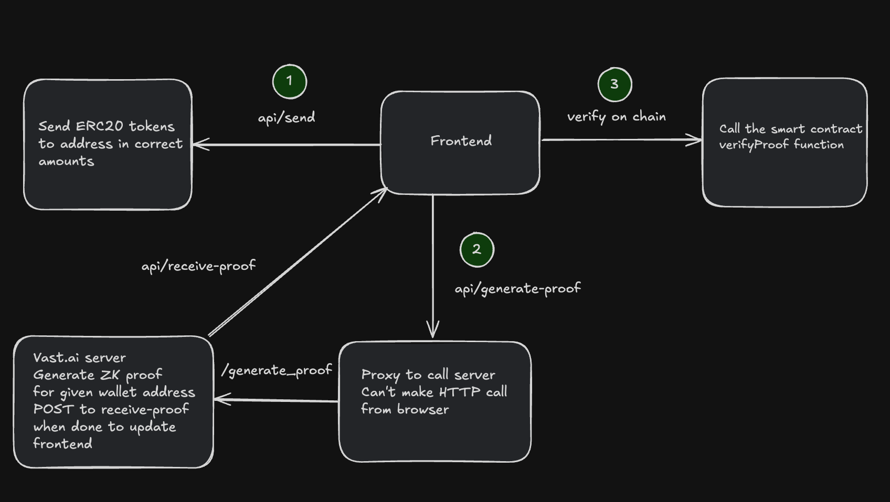

# Overview

This project is based on task #8:

Proof of receiving an exact bucket of assets (e.g., given a request for “10% wBTC, 30% ETH, 60% DOGE”, prove that this exact composition is received to a specific address).

The task is verified by a ZK proof that is generated using Succinct's library to write ZK proofs in Rust.

# Flow

1. User sends a fixed amount of tokens to an address on the frontend.

2. Once the tokens are received the user generates a proof that shows the amount of tokens in the reciever wallet equal the correct predetermined amounts (30 ETH, 60 DOGE, and 10 wBTC).

3. After the proof is generated the user can verify on chain that the proof is correct. There is also the ability to verify an existing proof if they don't want to wait to generate their own (it takes around 3 minutes).

# Technical Notes

The succinct prover netweork is still in early development so you need to be whitelisted to get an api key.For Groth16 proofs (EVM) succinct reccomends 16+ CPU, 16GB+ memory and 10GB+ of disk (https://docs.succinct.xyz/docs/sp1/getting-started/hardware-requirements). To handle generating the proofs without the network I rented out a server on vast.ai that would fit the requirements (its cheap). All proof generation is done on this server and then the results are passed back to the frontend.
